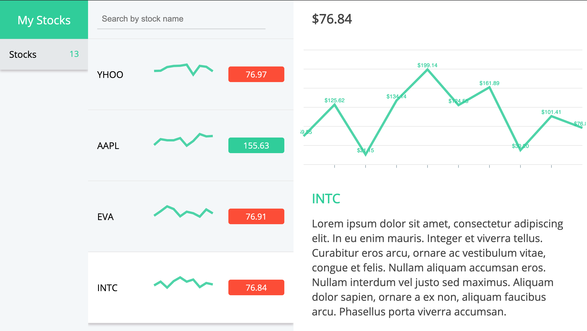

# MYSTOCKS

A dummy app with real-time stock data using react, redux along with charting library ( apexcharts )



## About

MYSTOCKS is an application, where a user can view stocks with real time values.

## Features

- Dynamic routing with next-router.
- State management with redux
- Styling with SASS and render using styled-jsx
- Linting with standard
- Apexcharts and more...

## Getting started

```
use node 10.13.0 or greater
git clone https://github.com/talentedandrew/myStocks my-project
cd my-project
npm install
npm run build
npm run start
```

Then open `http://localhost:3000/` to see your app.
